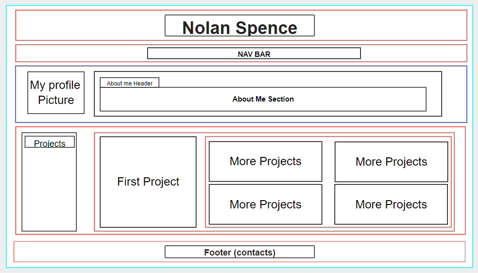

# Portfolio Website
​
## Table of contents
​
- [Overview](#overview)
  - [The challenge](#the-challenge)
  - [User Story](#user-story)
  - [Acceptance Criteria](#acceptance-criteria)
  - [Screenshot](#screenshot)
  - [Links](#links)
- [My process](#my-process)
  - [Built with](#built-with)
  - [What I learned](#what-i-learned)
  - [Continued development](#continued-development)
  - [Useful resources](#useful-resources)
- [Author](#author)
- [Acknowledgments](#acknowledgments)

​
## Overview
​
### The challenge
​
I challenged myself to built a personal portfolio website using HTML and CSS to showcase my prjects and skills.  The website will have links to my contact info as well as different projects that will be featured in this portfolio.  In addition, there will be an about me section to introduce myself.  Finally, media queries must be used to to ensure device compatibility for a truly fluid user experience regardless of device size.

### User Story
​
AS AN employer
I WANT to view a potential employee's deployed portfolio of work samples
SO THAT I can review samples of their work and assess whether they're a good candidate for an open position.
​
### Acceptance Criteria
​
GIVEN I need to sample a potential employee's previous work
WHEN I load their portfolio
THEN I am presented with the developer's name, a recent photo or avatar, and links to sections about them, their work, and how to contact them
WHEN I click one of the links in the navigation
THEN the UI scrolls to the corresponding section
WHEN I click on the link to the section about their work
THEN the UI scrolls to a section with titled images of the developer's applications
WHEN I am presented with the developer's first application
THEN that application's image should be larger in size than the others
WHEN I click on the images of the applications
THEN I am taken to that deployed application
WHEN I resize the page or view the site on various screens and devices
THEN I am presented with a responsive layout that adapts to my viewport
​
### Screenshot
​

​
Add a screenshot of your solution. The easiest way to do this is to use Firefox to view your project, right-click the page and select "Take a Screenshot". You can choose either a full-height screenshot or a cropped one based on how long the page is. If it's very long, it might be best to crop it.
​
Alternatively, you can use a tool like [FireShot](https://getfireshot.com/) to take the screenshot. FireShot has a free option, so you don't need to purchase it.
​
Then crop/optimize/edit your image however you like, add it to your project, and update the file path in the image above.
​
**Note: Delete this note and the paragraphs above when you add your screenshot. If you prefer not to add a screenshot, feel free to remove this entire section.**
​
### Links
​
- Solution URL: [Add solution URL here](https://your-solution-url.com)
- Live Site URL: [Add live site URL here](https://your-live-site-url.com)
​
## My process
​
### Built with
​
- HTML5 Markup
- CSS
- Media Queries
- Flexbox  
​
### What I learned
​
This challenged requited me to build a web application from scratch.  It was challenging to plan and organize this project from the ground up with no starting code.  First, I utilized my newly learned skill of making wire frames to design my desktop layout so that I had a visualization of how to use flexbox.  Here is the wireframe that I made:\
\
\
\
I learned how to make a sticky nav bar and header while still leaving space for it when using scroll links on my page.  Also, the z-index was very important to specify what layer the elements would be as it scrolled along the page.  Here are the snippets of CSS that make this feature function appropriately.

​
```css
html {
  scroll-padding-top: 200px; /* height of sticky header */
}

header {
  position: sticky;
  top: 0px;
  z-index: 1;
  height: 100px;
  background-color: var(--lt);
}

nav {
  position: sticky;
  top: 100px;
  display: flex;
  justify-content: space-around;
  align-content: center;
  padding: 10px;
  margin-bottom: 150px;
  z-index: 1;
  background-color: var(--dk);
}
```
​
​
### Continued development
​
From my experience gained working on this project I have realized my lack of skills using CSS.  I want to continue to practice so that I have a super solid understanding of how CSS selectors work and what is the most eloquent way to apply attributes to my HTML elemnts in my CSS code.
### Useful resources
​
- [Markdown Guide](https://www.markdownguide.org/basic-syntax/) - I continue to use this source as a referernce when writing my README.md to understand markdown syntax.
- [Difference between sticky and fixed position](https://stackoverflow.com/questions/19501919/difference-between-positionsticky-and-positionfixed) - This stackoverflow question helped me immensely in understanding the difference between sticky and fixed position so that I could effectively implement my sticky navbar and header.
- [Flexbox](https://css-tricks.com/snippets/css/a-guide-to-flexbox/) - This flexbox guide was a helpful quick reference when I had trouble with positioning my elements.
- [Transitions on hover](https://developer.mozilla.org/en-US/docs/Web/CSS/CSS_Transitions/Using_CSS_transitions) - I used this page as a reference to have hover transitions in my CSS.
​
## Author
​
**Nolan Spence**
- LinkedIn - [https://www.linkedin.com/in/aerospence/](https://www.linkedin.com/in/aerospence/)
​
## Acknowledgments
​
My teacher, Emmanuel Jacuban, helped me with understanding scroll-padding-top in CSS to keep my sticky navbar and heading from covering my page scroll links.

My tutor, Jacob Norman, helped me understand how CSS selectors could specifically reference elements through heiarchy and not just individual class and id.  He also should be cool dynamic effects CSS can achieve using pseudo classes like hover.
